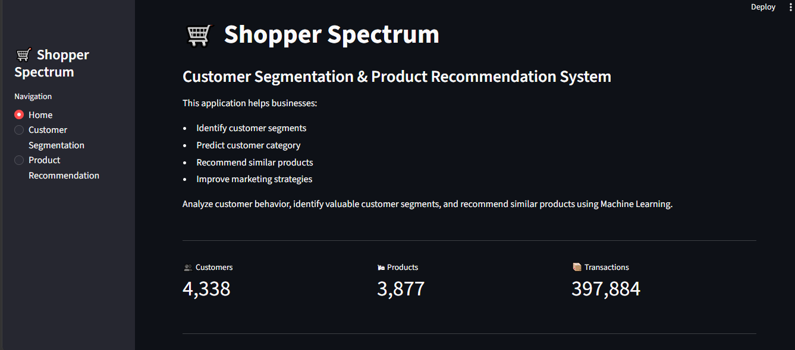
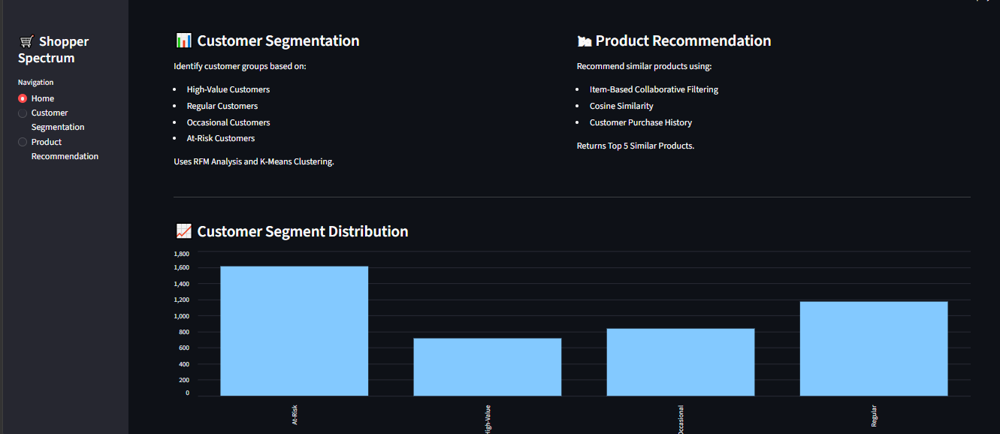
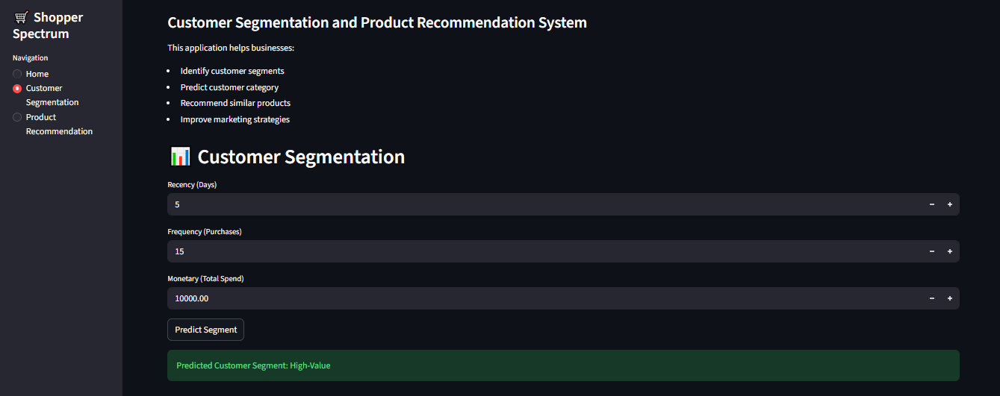
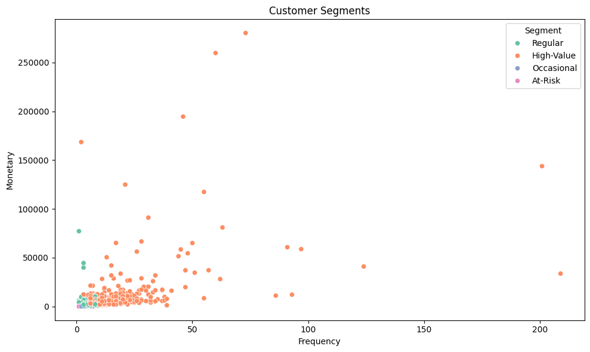
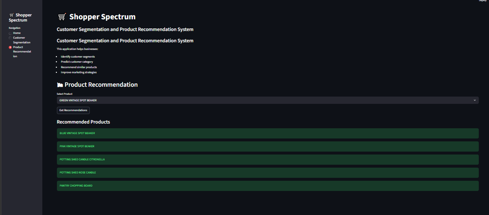
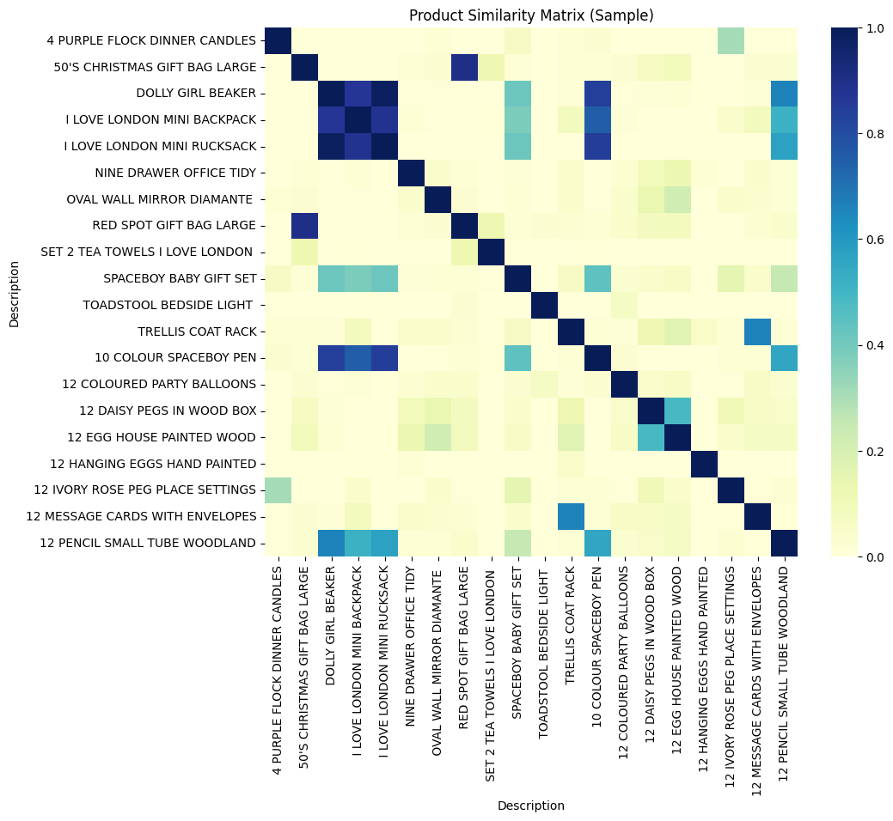
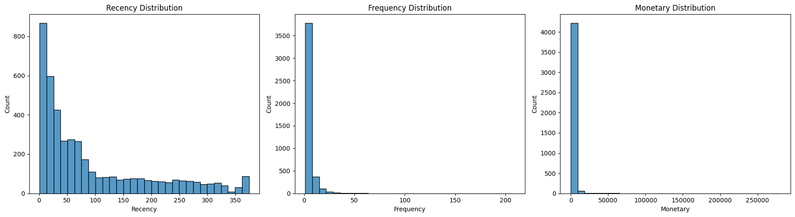

# 🛒 Shopper Spectrum: Customer Segmentation and Product Recommendation System

## 📌 Project Overview

Shopper Spectrum is an E-Commerce Analytics project that analyzes customer purchasing behavior and generates personalized product recommendations.

The project uses:

* RFM Analysis (Recency, Frequency, Monetary)
* K-Means Clustering
* Customer Segmentation
* Item-Based Collaborative Filtering
* Cosine Similarity
* Streamlit Web Application

The objective is to help businesses identify valuable customers, improve retention strategies, and recommend relevant products.

---

## 🎯 Business Use Cases

* Customer Segmentation for Targeted Marketing
* Product Recommendation System
* Customer Retention Programs
* Inventory Optimization
* Personalized Shopping Experience

---

## 📊 Dataset Information

Dataset: Online Retail Dataset

### Features

| Column      | Description         |
| ----------- | ------------------- |
| InvoiceNo   | Transaction Number  |
| StockCode   | Product Code        |
| Description | Product Name        |
| Quantity    | Quantity Purchased  |
| InvoiceDate | Transaction Date    |
| UnitPrice   | Product Price       |
| CustomerID  | Customer Identifier |
| Country     | Customer Country    |

---

## 🧹 Data Preprocessing

Performed the following steps:

* Removed missing CustomerID values
* Removed cancelled invoices
* Removed zero and negative quantities
* Removed zero and negative prices
* Converted InvoiceDate to datetime format
* Created TotalAmount feature

### Dataset Summary

| Metric           | Count   |
| ---------------- | ------- |
| Original Records | 541,909 |
| Cleaned Records  | 397,884 |
| Removed Records  | 144,025 |
| Customers        | 4,338   |
| Products         | 3,877   |

---

## 📈 Exploratory Data Analysis

Performed:

* Country-wise transaction analysis
* Top-selling products analysis
* Purchase trend analysis
* RFM distribution analysis
* Customer spending analysis

---

## 🧠 Customer Segmentation

### RFM Features

Recency = Latest Purchase Date − Customer Last Purchase Date

Frequency = Number of Transactions

Monetary = Total Amount Spent

### Clustering Algorithm

* K-Means Clustering
* Elbow Method
* Silhouette Score

### Customer Segments

| Segment    | Description                          |
| ---------- | ------------------------------------ |
| High-Value | Frequent and high-spending customers |
| Regular    | Consistent customers                 |
| Occasional | Low-frequency customers              |
| At-Risk    | Customers inactive for a long time   |

---

## 🛍 Product Recommendation System

Implemented:

* Item-Based Collaborative Filtering
* Customer-Product Matrix
* Cosine Similarity

The system recommends Top 5 similar products for a selected product.

---

## 📱 Streamlit Application

### Features

### Customer Segmentation

Input:

* Recency
* Frequency
* Monetary

Output:

* Predicted Customer Segment

### Product Recommendation

Input:

* Product Name

Output:

* Top 5 Similar Products

---

## 📸 Project Screenshots

### Home Page





---

### Customer Segmentation



---

### Customer Segment Visualization



---

### Product Recommendation



---

### Similarity Matrix



---

### RFM Analysis



---

## 📂 Project Structure

```text
shopper-spectrum-ecommerce
│
├── app.py
├── README.md
├── requirements.txt
│
├── data
│   └── online_retail.csv
│
├── models
│   ├── feature_columns.pkl
│   ├── kmeans.pkl
│   ├── scaler.pkl
│   ├── segment_mapping.pkl
│   └── product_list.pkl
│
├── notebook
│   └── Shopper_Spectrum.ipynb
│
└── Screenshots
    ├── home_page1.png
    ├── home_page2.png
    ├── Customer_Segmentation.png
    ├── Customer_Segmentation_Graph.png
    ├── Product_Segmentation.png
    ├── Product_heatmap_similarity_matrix.png
    └── RFM_Distribution_Analysis.png

```

> **Note:** `product_similarity.pkl` is excluded from GitHub because it exceeds GitHub's 100 MB file size limit. The recommendation model can be regenerated by running the notebook.

---

## 💻 Technologies Used

* Python
* Pandas
* NumPy
* Matplotlib
* Seaborn
* Scikit-Learn
* Streamlit
* Pickle

---

## 🚀 Run Locally

```bash
pip install -r requirements.txt
```

```bash
python -m streamlit run app.py
```

---

## 👨‍💻 Author

Vinay Pandey

MCA | Data Science with AI

Python Developer | Machine Learning Enthusiast
